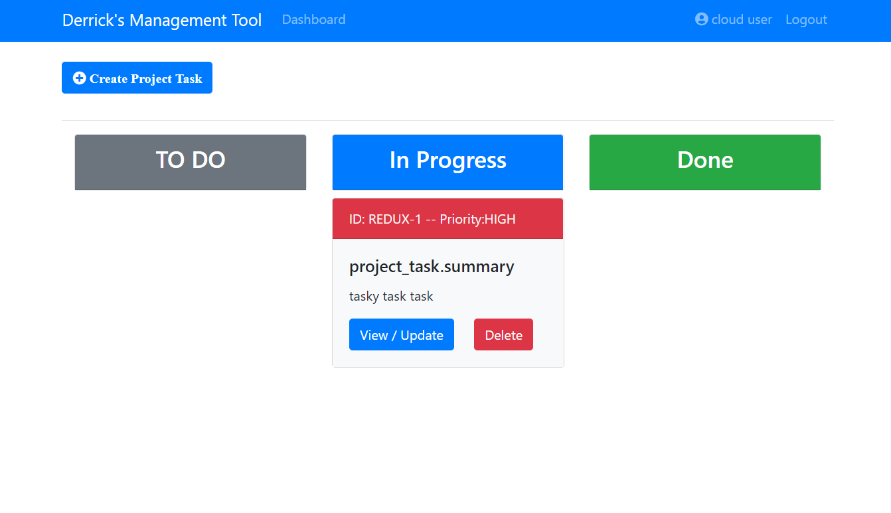

# 
# kanban_java+react-redux
<table>
<tr>
<td>
  A JWT tokens secured project management application, built with Spring for backend services and React JS + Redux as frontend framework, and deployed to Azure.

</td>
</tr>
</table>

## Demo
https://limitless-bayou-42020.herokuapp.com/

## Site

### User Registration

Custom exception handling for each form fields which dynamically renders if invoked for instances of existing email, invalid email format, and password length.

### User Sign In

Custom exception handling for each form field to dynamically render if invoked for instances of invalid email or incorrect password

### Dashboard

Dashboard direction specific for each user that is currently signed in. Each created project will render dynamically here. Allows for users 

### Create Project

Within the dashboard the user has the ability to view their tasks, create another project, logout to work as another user (in the global navigation), update their project information, or delete their project all together.
### Add Task

Custom exceptions handling is included in all the form field for requiring input for name and due date, if the options is left untouched for the "Priority" or "Status" the field will by default be "LOW" and "TO DO" respectively.

### Update Task

## Built with 

- [Spring boot]() - to build REST APIs for CRUD operations.
- [React JS]() - Front end framework
- [Bootstrap](http://getbootstrap.com/) - Front end library
- [React Redux]() - Manage state of application in the front-end
- [Redux Thunk]() - Manages the state of application in the front-end
- [JWT Tokens]() - Securing application using JWT generated tokens
- [Babel](https://babeljs.io/docs/en/next/) - toolchain to convert ECMAScrit 2015+ code into a backwards compatible version of javascript in cross-origin browser or environments
- [axios](https://www.npmjs.com/package/axios) - promise based HTTP client for the browser and node.js
- [classnames]() - Replacement for `classSet`, to make dynamic and conditional props in React
- [MySQL]() - Relational database management system for domain modeling
- [H2 Database]() - In memory database for early stage development process
-[Heroku]() - Deployed to Heroku using ClearDb

## To-do
- Azure (Currently deployed on Heroku)

